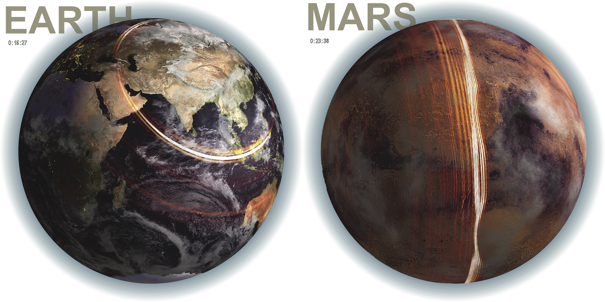

# Seismic waves - Course

This repository holds additional course material to teach a class called "Seismic waves".

## Syllabus

In this course, the students will learn the theoretical and computational fundamentals of global seismic wave propagation.
Major concepts about body and surface waves as well as normal modes are introduced.

<!--  -->

### Time and Location

- Wed/Thu, 9:00 - 10:30
- KAUST building 9, level 4, room 4138

### Instructor: Daniel Peter
- KAUST building 1, office #0146  
- daniel.peter@kaust.edu.sa

The material in this repository is used for teaching purposes. You may reuse it freely to produce, share and build on knowledge - education is open to all.
